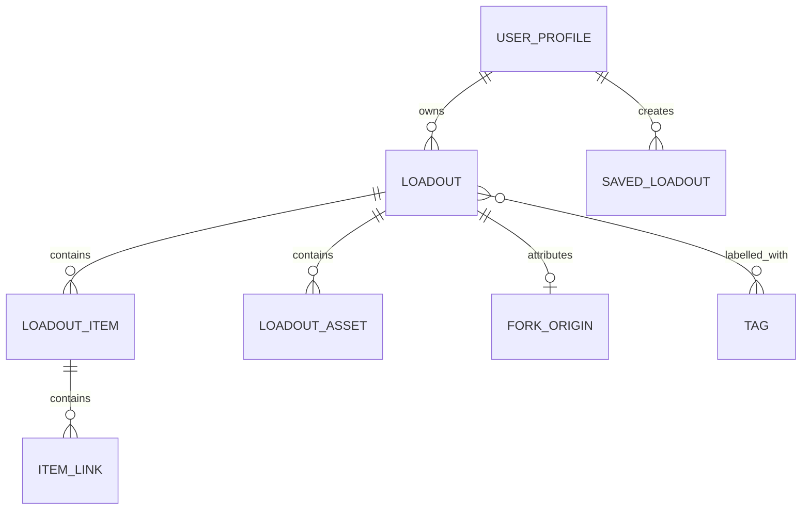

# BagLog persistence architecture

## Purpose and scope

This document defines the local persistence boundary for BagLog. It is the
design contract for `BagLogPackage/Sources/Persistence` and covers SwiftData
schema, file-backed media, migrations, concurrency, and the APIs consumed by
the rest of the app.

It does **not** define feature UI, authentication, discovery, networking,
StoreKit, or the remote API. Those systems may read or update local state only
through the persistence APIs described here.

## Decisions

- SwiftData is the on-device source of truth for the person's drafts, private
  loadouts, locally cached public loadouts, and pending local changes.
- Every record has a stable app-owned `UUID`; SwiftData's persistent identifier
  is an implementation detail and is never sent to another device or service.
- The module returns immutable, `Sendable` snapshots and accepts `Sendable`
  commands. `@Model` instances and `ModelContext` never leave the persistence
  boundary.
- Original photos and videos live in Application Support. SwiftData stores
  metadata and a small optional thumbnail only.
- Schema V1 and its migration plan exist before the first store ships, even
  when the V1 plan is a no-op.

The first release is local-first, not offline-only. A future server owns the
canonical public catalogue; locally persisted remote data is a cache that must
remain useful and safe while offline.

## Boundary

```text
Feature / sync / media clients
            │  IDs, commands, snapshots
            ▼
      Persistence module
  repositories · schema · migration
            │
      SwiftData ModelContainer
            │
  Application Support media files
```

`Persistence` has no SwiftUI, feature, networking, authentication, StoreKit,
or third-party dependencies. The app composition root creates the
`ModelContainer`, configures the live persistence store, and injects a
`LoadoutPersisting` interface into feature and service clients.

Views may use `@Query` only for simple, view-local projection from the shared
main context. All edits, fork creation, deletion, imports, sync reconciliation,
and file cleanup use repository methods. A feature must not mutate a SwiftData
model directly.

## Stored model

The domain's aggregate root is `Loadout`: one practical set of things for one
scenario. A list is intentionally not a generic social post with a checklist.



### Common fields and representation

Each `@Model` type persists an explicit `id: UUID`, `createdAt`, and
`updatedAt` where the record can be independently changed. IDs are generated
in the repository, never inferred from a title or relationship. Persist enums
as stable raw strings, and expose typed computed properties in the model or
snapshot layer. This keeps the store durable if enum cases are renamed in code.

Use `summary`, never `description`, as a persisted property name. Validate and
normalise values at command boundaries; the stored models should not contain
feature-specific validation logic.

### `UserProfile`

The locally known creator identity. It is not an authentication record.

| Field | Notes |
| --- | --- |
| `id` | Stable profile ID. |
| `handle`, `displayName`, `bio` | Cached visible identity. `bio` is optional. |
| `avatarAssetID` | Optional reference to managed media. |
| `loadouts` | Inverse of `Loadout.owner`. |

Tokens, Apple credentials, and StoreKit transaction state are excluded. An
account reset is the only operation allowed to delete a profile and cascade its
locally owned content.

### `Loadout`

The aggregate root and the sole persisted object directly addressed by editing
commands.

| Group | Fields |
| --- | --- |
| Identity | `id`, `ownerID`, `remoteID: String?` |
| Content | `title`, `summary`, `categoryRaw`, `visibilityRaw`, `statusRaw` |
| Lifecycle | `createdAt`, `updatedAt`, `publishedAt`, `archivedAt` |
| Sync cache | `syncStateRaw`, `lastSyncedAt`, `remoteRevision: String?` |
| Relationships | `owner`, `items`, `assets`, `tags`, `forkOrigin` |

`visibility` (`private` / `public`) and `status` (`draft` / `published` /
`archived`) are separate. A public-intended draft is therefore not published by
accident. Item and asset counts, and total item quantity, are derived from the
children instead of stored as mutable counters.

`ownerID` is the stable scalar used for queries; the repository keeps it equal
to `owner.id` whenever it creates or changes the relationship. `remoteID` is
assigned only after a successful remote acknowledgement.
`remoteRevision` is opaque to the app and supports safe future reconciliation.
Neither field is required for a valid local draft.

### `LoadoutItem` and `ItemLink`

`LoadoutItem` describes a thing in one particular loadout, not a global product
catalogue entry. This preserves the context-specific title, notes, quantity,
and order that make a fork independently editable.

| Model | Fields |
| --- | --- |
| `LoadoutItem` | `id`, `title`, `brand?`, `model?`, `notes?`, `quantity`, `sortIndex`, `isEssential`, `loadout`, `links` |
| `ItemLink` | `id`, `urlString`, `label?`, `sortIndex`, `item` |

URLs are parsed and validated before persistence, then stored as strings so an
imported or later-invalid value remains recoverable. The repository assigns an
explicit `sortIndex` for every item and link; relationship-array order is never
used as authored order.

### `LoadoutAsset`

`LoadoutAsset` stores media metadata only:

- `id`, `mediaKindRaw`, `sortIndex`, and optional `caption`.
- `localFileName` for a file managed by `MediaStore`.
- `remoteURLString` for a remotely available copy.
- optional small `thumbnailData`, marked `@Attribute(.externalStorage)`.
- `loadout`, the required inverse relationship.

Original files are named from the asset UUID and stored below an app-owned
Application Support directory. Do not persist file URLs, security-scoped URLs,
or full-resolution `Data` in SwiftData. Deleting a loadout first removes its
database graph, then asks `MediaStore` to remove file names collected before
the transaction; failures are recorded for retry by a maintenance job.

### `Tag`

`Tag` is reusable metadata with `id`, `name`, `normalizedName`, timestamps,
and the inverse many-to-many `loadouts` relationship. Tag creation lowercases,
trims, and normalises whitespace before reusing a local match. `normalizedName`
is not a database uniqueness constraint in V1 because an eventual remote
conflict policy has not been defined. Maintenance may prune unused tags; an
editor action never deletes a shared tag.

### `ForkOrigin`

`ForkOrigin` is a single immutable child of a forked loadout. It holds:

- `sourceLoadoutID` and optional `sourceRemoteID`;
- `rootLoadoutID`, retained across a chain of forks;
- visible attribution: `sourceTitle`, `sourceAuthorHandle`;
- `forkedAt`.

It deliberately stores an attribution snapshot rather than depending on a
relationship to the source. Credit remains available when the source is not in
the local cache, has changed, or cannot be fetched offline.

### `SavedLoadout`

`SavedLoadout` is a per-profile join record: `id`, `profileID`, `loadoutID`,
and `savedAt`. It stores stable IDs rather than relationships, so a saved
remote reference survives cache eviction. Save and reaction counts displayed on
a loadout are read-only server cache values when introduced; this device never
increments them optimistically as authoritative counters.

## Ownership and deletion

Every persisted relationship declares both an inverse and an explicit delete
rule.

| Owner | Relationship | Delete rule / outcome |
| --- | --- | --- |
| `UserProfile` | locally owned `Loadout`s | `.cascade`; only during account reset. |
| `Loadout` | `items`, `assets`, `forkOrigin` | `.cascade`. |
| `LoadoutItem` | `links` | `.cascade`. |
| `Loadout` ↔ `Tag` | many-to-many | `.nullify`; unused tags are later pruned. |
| `SavedLoadout` | profile/loadout IDs | no object cascade; a stale reference is recoverable. |

Forking creates fresh IDs for the loadout, every item, link, and asset metadata.
It does not share mutable children, duplicate private media files, or copy
likes, saves, or analytics. The repository persists the complete fork before
returning its snapshot, so the editor always starts with stable identity.

## API and concurrency contract

The module exposes `Sendable` data only. Representative API shapes are:

```swift
protocol LoadoutPersisting: Sendable {
    func loadout(id: UUID) async throws -> LoadoutSnapshot?
    func save(_ command: SaveLoadoutCommand) async throws -> LoadoutSnapshot
    func fork(_ command: ForkLoadoutCommand) async throws -> LoadoutSnapshot
    func deleteLoadout(id: UUID) async throws
}
```

Commands contain scalar values, IDs, and ordered child commands. Snapshots are
immutable value types with typed enums and ordered child snapshots. They never
expose `PersistentIdentifier`, `@Model` classes, or lazy relationships.

The container is created once at app launch. The UI-facing context is confined
to `@MainActor`; a repository that performs work outside the UI uses a dedicated
SwiftData `@ModelActor` created from the same container. Background work passes
an app ID or snapshot into the repository, which refetches there. It never
passes a `ModelContext` or model instance across isolation.

One command is one persistence transaction. The repository validates the whole
command, applies ordered graph changes, calls `try modelContext.save()`, and
only then returns a snapshot. It must not rely on SwiftData autosave for a
create, fork, publish acknowledgement, or delete. A failed save leaves staged
media unreferenced and eligible for cleanup.

## Schema, migrations, and indexes

Define `BagLogSchemaV1` with the complete V1 model list and make
`BagLogMigrationPlan` the only migration configuration used when constructing
the container. V1 is a stage, not an informal collection of models. Future
changes add a versioned schema and either a lightweight or custom migration;
they never mutate an already-shipped schema in place.

Initial indexes should support actual local access patterns:

| Model | Indexed fields | Query supported |
| --- | --- | --- |
| `Loadout` | `updatedAt`, `statusRaw`, `visibilityRaw`, `categoryRaw`, `ownerID` | library sorting and filtering |
| `LoadoutItem` | `sortIndex` | ordered item fetch |
| `Tag` | `normalizedName` | tag reuse lookup |
| `SavedLoadout` | `profileID`, `loadoutID` | saved-state lookup |

Use SwiftData `#Index` declarations in the schema/model definitions. Add a
compound index only after profiling proves a predicate needs one. Store sync
state as local implementation metadata and keep it out of feature-facing
snapshots unless a feature genuinely needs to show sync feedback.

## Lifecycle and failure handling

1. **Create/update:** validate a command, upsert the owned graph by app ID,
   assign explicit ordering, save, and return a snapshot.
2. **Media stage:** `MediaStore` writes a temporary file, moves it to its
   UUID-derived final name, then the repository saves its metadata. Orphaned
   final files are cleaned up if saving fails.
3. **Fork:** build a new complete graph and immutable `ForkOrigin`, save it,
   then return the draft.
4. **Remote acknowledgement:** find by app ID, atomically update `remoteID`,
   revision, lifecycle, and sync metadata, then save.
5. **Delete:** collect managed file names, delete and save the graph, then
   perform retryable file removal.
6. **Maintenance:** periodically remove unreferenced managed media, retry
   failed file deletions, and prune unreferenced tags. Maintenance must never
   purge a private draft or an unsynced local change.

The persistence error surface distinguishes validation, not-found, write,
migration, and media-storage failures. It does not leak raw SwiftData errors to
views. Repositories log only operational metadata needed to diagnose a failure;
they never log private titles, notes, URLs, or media paths.

## Verification

The persistence target has focused Swift Testing coverage for:

- graph creation, updates, ordering, and explicit saves;
- cascade/nullify deletion behaviour and media cleanup handoff;
- tag normalisation and reuse;
- fork identity independence and durable attribution;
- snapshots and commands crossing actor boundaries;
- migration from each released schema version; and
- in-memory-container error paths, including failed save cleanup.

Production builds use a disk-backed container. Tests use a fresh in-memory
container and a temporary `MediaStore` directory per test, so no test reads or
deletes user data.
