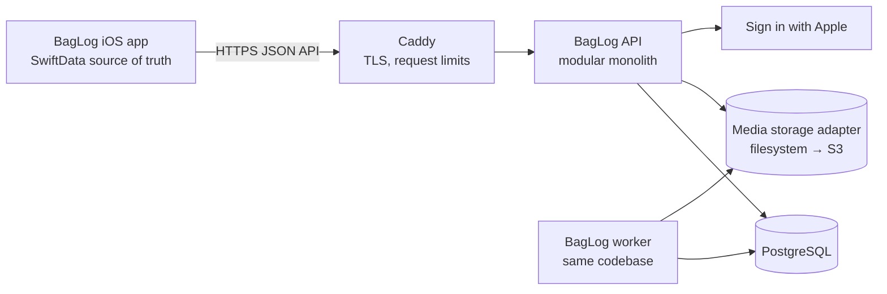
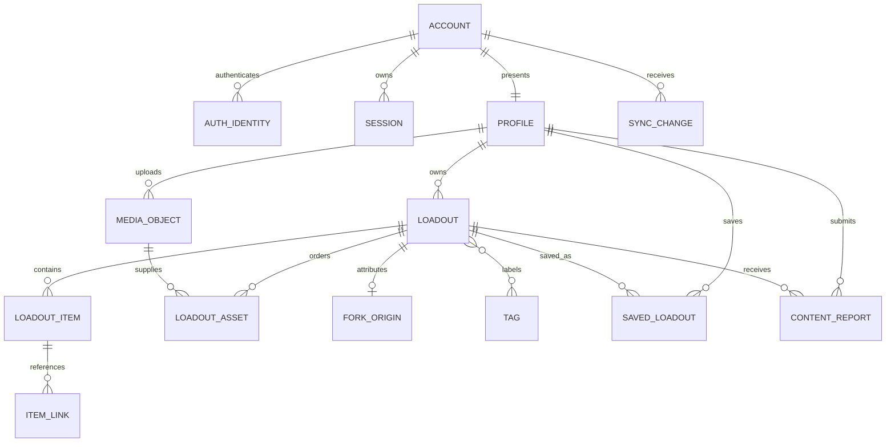

# BagLog backend architecture

## Status and release boundary

Status: proposed for Release 1.1 and later.

Release 1.0 remains local-first and does not depend on this backend. The first
server-backed release should add accounts and reliable synchronization while
preserving the current offline create → publish → fork workflow. Discovery,
reactions, subscriptions, and creator tooling should remain later slices.

This design assumes:

- the first deployment is a Raspberry Pi 5 with 4 GB RAM and a 256 GB SSD;
- the server must run on Linux ARM64 and later move to ordinary cloud
  infrastructure without rewriting product logic;
- SwiftData remains the iOS source of truth while the app is running;
- application-owned UUIDs remain stable across local and remote records; and
- media bytes do not live in PostgreSQL.

## Decision summary

Use a modular monolith with these deployable components:

| Component | Initial implementation | Scale-out replacement |
| --- | --- | --- |
| API | One stateless Go process | Multiple identical replicas behind a load balancer |
| Database | PostgreSQL 18 on the Pi SSD | Managed PostgreSQL, then replicas when measurements justify them |
| Media | Filesystem adapter on the Pi SSD | S3-compatible object storage and a CDN |
| TLS and reverse proxy | Caddy | Cloud load balancer or ingress proxy |
| Background work | Worker mode in the same codebase | Independently scaled worker replicas |
| Cache | None | Redis only for a measured hot path or distributed rate limiting |

The proposed server language is Go because it produces a small Linux ARM64
deployment artifact, has a low idle memory footprint, and makes stateless
horizontal replication straightforward. Keep the dependency set deliberately
small: the standard library for HTTP, JSON, logging, and cryptography, plus a
PostgreSQL driver. Swift with Vapor remains possible, but it adds more runtime
and framework weight to the smallest deployment without improving the domain
boundary.

The official PostgreSQL container supports `arm64v8`, Docker supports Debian
ARM64, and Go supports Linux ARM64. Pin exact image versions and digests in the
deployment configuration instead of using `latest`.

## Architecture fit

Clean/hexagonal boundaries are a fit for the backend and sync integration:

- the filesystem must later be replaceable by object storage;
- the Pi database must later be replaceable by managed PostgreSQL; and
- the iOS app must add networking without allowing transport DTOs into SwiftUI
  or SwiftData models into the network layer.

This is a boundary decision, not a request to introduce MVVM or a framework.
The current SwiftUI data-flow conventions should remain unchanged.



## Server module boundaries

The first executable backend should use this structure:

```text
Backend/
├── cmd/
│   └── baglog/                 # process entry point and configuration
├── internal/
│   ├── account/                # Apple identity, sessions, profile
│   ├── loadout/                # aggregate, publication, fork rules
│   ├── catalogue/              # public reads, search, keyset pagination
│   ├── media/                  # upload lifecycle and storage port
│   ├── sync/                   # revisions, cursors, idempotency
│   ├── safety/                 # moderation, reports, profile blocks
│   ├── platform/
│   │   ├── postgres/           # repository implementations
│   │   ├── filestore/          # Raspberry Pi media adapter
│   │   └── httpapi/            # routing, auth, DTO mapping
│   └── testkit/                # deterministic test adapters
├── Database/Migrations/
├── OpenAPI/
└── Deploy/                     # added after runtime dependencies are approved
```

Each product module owns its use cases and repository ports. SQL, HTTP, Apple
identity verification, and media storage implement those ports from the
outside. Handlers must not contain SQL or product rules.

Do not split these modules into network services initially. Transactional
publication, forking, media references, and sync-change creation are simpler
and safer in one process and one database. A module may become a service only
after independent scaling or ownership is demonstrated by production data.

## Domain and database model

The initial schema is in
`Backend/Database/Migrations/000001_initial_schema.sql`.



Important choices:

- A local UUID is also the remote resource UUID. Do not create a second
  identity for the same loadout. During migration, `remoteID` can contain the
  UUID string and later be retired.
- `Loadout` is the write aggregate. Items, links, ordered media associations,
  tags, and fork attribution are updated in one database transaction.
- `revision` is a monotonically increasing integer on each loadout. It is the
  optimistic-concurrency token and is returned as the HTTP `ETag`.
- Deletes are soft at the aggregate root until every device can consume a
  tombstone. A retention job performs the later hard delete.
- Media objects are immutable and referenced by ordered loadout assets. A fork
  creates new item, link, and asset IDs but may reference the same immutable
  media object. Garbage collection removes bytes only after no record refers
  to them and the retention window has expired. Account erasure and moderation
  may remove an owned media object sooner; its asset associations are then
  removed from forks as well.
- Fork attribution stores source and root UUIDs plus a title/handle snapshot.
  It therefore survives source renames or moderation. Account erasure must
  pseudonymize the stored author handle.
- Product categories are text, not a PostgreSQL enum. Unknown server-provided
  category identifiers can continue to round-trip through the iOS app.
- Status, visibility, media kind, and server state have database checks because
  those values control invariants rather than catalogue vocabulary.
- Public catalogue queries include only moderation-approved loadouts and omit
  profiles blocked by the requesting user.

### SwiftData migration mapping

| Current local value | Remote representation |
| --- | --- |
| `UserProfile.id` | `profiles.id`; accepted from the first device, returned by the server on later devices |
| `Loadout.id` | `loadouts.id`; the same application-owned UUID |
| `remoteID` | Transitional only; set to the same UUID string, then retire in a later local schema migration |
| `remoteRevision` | Decimal string form of the server `revision` until the local type can become an integer |
| `syncState` | Local-only UI/queue state; never accepted as server truth |
| `localFileName` | Remains device-local and is never uploaded as a storage key |
| `remoteURLString` | Derived from an authorized media response; not stored as a permanent server URL |
| `thumbnailData` | Kept locally for offline rendering; server thumbnails live in media storage |
| `sourceRemoteID` | Transitional alias of `sourceLoadoutID`; the backend uses the stable UUID |

## API contract

The design-first HTTP contract is in `Backend/OpenAPI/baglog-v1.yaml`.

Rules common to all endpoints:

- expose only HTTPS outside the Docker network;
- use `/v1` versioning and JSON with RFC 3339 UTC timestamps;
- return a stable machine-readable error `code` and a request `trace_id`;
- use cursor-based pagination, never page-number/offset pagination for feeds;
- require an `Idempotency-Key` UUID on retried mutations;
- return `ETag: "<revision>"` for loadout aggregates;
- require `If-Match` for updates and deletes, and return `412` with the current
  revision when the client is stale; and
- cap body sizes and list limits at the edge and again in the API.

The private account/sync vertical slice needs only:

1. Sign in with Apple token exchange and refresh/logout.
2. Read/update the authenticated profile and request account deletion.
3. Create, fetch, update, publish, and delete an owned loadout aggregate.
4. Fork a published public loadout in one server transaction.
5. Pull the authenticated account's sync changes by cursor.
6. Prepare, upload, and complete an image upload.

Before the shared catalogue ships, add the second safety slice:

1. moderation state and a protected review queue;
2. objectionable-content filtering before publication;
3. in-app loadout reporting and operational response ownership;
4. profile blocking that removes the blocked profile's content from discovery;
5. published support/contact information; and
6. keyset-paginated catalogue reads limited to approved content.

Likes, follows, comments, notifications, billing, and analytics are deliberately
absent from the first contract.

## Authentication and authorization

Use Sign in with Apple as the initial identity provider:

1. The iOS app obtains an identity token, authorization code, and nonce through
   Authentication Services.
2. The API validates issuer, audience, expiry, signature, and nonce against
   Apple's keys, then binds the stable Apple subject to an account.
3. The API returns a short-lived access token and a rotating opaque refresh
   token. Only a cryptographic hash of the refresh token is stored.
4. Refresh-token reuse revokes that session family.

Every repository query must receive the authenticated account/profile ID. A
private or draft loadout is readable only by its owner. Public catalogue reads
must filter `status = published`, `visibility = public`, `moderation_state =
approved`, `deleted_at IS NULL`, and the requester's block list. PostgreSQL is
reachable only from the private application network; it is never exposed
through the router.

Store no Apple identity token, authorization code, raw refresh token, or media
URL containing credentials. Email is not required for the core product and
should not be stored unless a later feature has a clear need.

Because the server creates an account, the app must expose account deletion.
The deletion request immediately revokes sessions and hides public content,
queues Sign in with Apple token revocation, and schedules removal of profile,
loadout, session, media, and identity data. Fork attribution outside the
account is pseudonymized. Retain anything only when there is a documented
legal or fraud-prevention requirement and disclose that policy to the user.

## Safety and moderation

A real public BagLog catalogue is user-generated content. It must not launch as
an unmoderated table filter. Publication moves a public loadout to `pending`;
only `approved` content is discoverable. `rejected` and `hidden` content is
excluded even when its product status remains published.

The first Pi beta can use a protected manual review command or small internal
review surface. The operational process must define who receives reports, how
quickly they are reviewed, and how abusive accounts and content are removed.
Automated text/image moderation may be added later through a port, but no
external provider is assumed by this schema.

Blocking is directional. A blocker no longer sees the blocked profile or its
loadouts in catalogue/search results. Reports remain available to moderators
after a reporter deletes their account, without retaining the reporter's
profile identifier.

## Offline sync contract

SwiftData remains the immediate source of truth. UI actions write locally and
enqueue a durable mutation; a sync actor sends mutations and applies remote
changes later. Views never wait for the network to display a local edit.

### Push

The app sends the whole loadout aggregate with:

- its stable UUID;
- the last acknowledged `base_revision`;
- an idempotency key; and
- ordered item, link, tag, and media-association values.

The server locks the aggregate, compares revisions, validates ownership and
the complete graph, writes it, increments the revision, adds a sync-change row
and an outbox event, then commits once.

If the revision is stale, the server returns `412 Precondition Failed` and the
current server aggregate. The app must preserve its local mutation and present
or apply an explicit merge policy; it must never silently overwrite either
copy. Because one loadout normally has one editor, aggregate-level optimistic
concurrency is preferable to a premature field-level CRDT.

### Pull

`GET /v1/sync/changes?after=<cursor>` returns ordered upsert references and
tombstones visible to the account. Omitting `after` requests a fresh baseline:
the server captures a high-water cursor and pages through the account's current
profile and loadouts. The app persists the new cursor only after all returned
changes are durably applied to SwiftData. Cursors are opaque to the client even
if the first implementation uses a PostgreSQL identity value.

Change rows may be pruned after a documented maximum offline window. A cursor
older than that window returns `410 sync_cursor_expired`; the app requests a
new baseline and reconciles it with any unsent local mutations. It must not
discard the local queue during a full resync.

Public discovery is not replicated through the private sync feed. It is read
from the catalogue API and locally cached as needed.

### iOS boundary

Add remote behavior without moving networking into `Persistence`:

```text
BagLog/Application
    └── composes and starts synchronization
Services
    ├── BagLogAPIClient actor          HTTP and transport DTOs
    └── BagLogSyncEngine actor         retry, cursor, conflict orchestration
BagLogPackage/Persistence
    ├── existing local aggregates
    ├── pending mutation records
    └── sync cursor and tombstone application APIs
```

Transport DTOs map to persistence commands/snapshots in `Services`. SwiftUI
continues reading local snapshots. Cancellation should propagate through
network calls, while durable mutations survive task and process cancellation.

## Media lifecycle

Use a three-step protocol:

1. `prepare` validates content type and declared size and creates a pending
   media object plus a short-lived upload capability;
2. `upload` streams bytes to the storage adapter without buffering the complete
   file in memory; and
3. `complete` verifies size/hash, extracts safe metadata, creates a thumbnail,
   and marks the object ready.

Initially the upload URL points back to the API and the filesystem adapter
writes an atomic temporary file then renames it below a non-public media root.
At scale, the same prepare response can contain a presigned object-storage URL.
Database rows keep opaque storage keys, never host-specific absolute paths or
permanent public URLs.

Enforce a small image limit for the first release, allow-list decoded image
formats, ignore supplied filenames, and re-encode thumbnails. Video should
remain disabled until asynchronous transcoding and moderation exist.

When an account is erased or an image is removed for safety reasons, owned
media bytes and every `LoadoutAsset` association to that object are removed.
Forked kits keep their copied item/link graph and use their normal visual
fallback if the shared image disappears.

## Raspberry Pi deployment

Use Raspberry Pi OS Lite 64-bit or Debian ARM64. Put the OS, PostgreSQL data,
media, and container volumes on the SSD, not an SD card. Keep PostgreSQL
`fsync` and full-page writes enabled. A small UPS is strongly recommended.

Initial topology:

```text
Internet
   │ TCP 80/443 only
Router / DNS
   │
Caddy container
   │ private container network
BagLog API container ─── PostgreSQL container
   │
SSD media volume
```

Resource starting points—not permanent tuning values:

| Concern | Initial setting |
| --- | --- |
| API replicas | 1 |
| API database pool | 5 connections |
| PostgreSQL `shared_buffers` | 256 MB |
| PostgreSQL `effective_cache_size` | 1 GB |
| PostgreSQL `max_connections` | 30 |
| Upload concurrency | 2 |
| Request timeout | 15 seconds excluding streamed upload bodies |
| Maximum API JSON body | 1 MB |

Measure before tuning. Leave at least half the RAM available for Linux page
cache, temporary work, deployment, and backup jobs. Do not run Kubernetes,
Redis, Elasticsearch, or an S3 server on the 4 GB Pi initially.

For public HTTPS, the domain must resolve to the server and ports 80/443 must
be reachable. If the home connection uses CGNAT, use a trusted tunnel/VPS edge
or move the public edge off the home network. This is an infrastructure choice,
not an API change.

## Backups and operations

A single Pi is not highly available. Before real user data is accepted:

- create nightly encrypted logical database backups to a different physical
  location;
- back up media objects and the manifest that maps storage keys;
- retain multiple daily and weekly generations;
- run a scheduled restore test into an empty database;
- monitor SSD health and free space;
- expose separate liveness and dependency-aware readiness endpoints;
- log structured events with request IDs but no tokens, private descriptions,
  item URLs, or image metadata; and
- alert on backup failure, repeated 5xx responses, database saturation, disk
  usage, and certificate-renewal failure.

Target recovery objectives for the Pi beta should be explicit. A reasonable
starting proposal is RPO ≤ 24 hours and RTO ≤ 4 hours. Production targets will
require more frequent backups and a database outside the single Pi.

## Scale-out path

| Stage | Trigger | Change |
| --- | --- | --- |
| Pi beta | Private testers and low traffic | One API, PostgreSQL, filesystem media, Caddy |
| Durable single region | Real users or uptime requirement | Managed PostgreSQL, object storage, offsite secrets/backups |
| Horizontal API | Sustained CPU or concurrency pressure | Multiple stateless API/worker replicas behind a load balancer |
| Read-heavy discovery | Catalogue query latency or database CPU | CDN for media, tuned indexes, optional read replica/cache |
| Large event volume | Outbox backlog or independent ownership | Dedicated worker pool; extract only the proven module boundary |
| Very large tables | Measured maintenance/query pressure | Time partition event tables; archive old idempotency and sync rows |

Migration from the Pi is a planned restore, not a redesign: stop writes, make a
final PostgreSQL dump, copy media objects preserving storage keys, restore into
managed services, change configuration, verify, then switch DNS. Before that
day, rehearse the process with a staging database.

PostgreSQL streaming or logical replication is available for later migrations
and replicas, but it is unnecessary for the first deployment.

## Verification strategy

The backend implementation should have:

- unit tests for publication, authorization, fork isolation, validation,
  revision conflicts, moderation visibility, blocking, account erasure, and
  media state transitions;
- repository integration tests against a real temporary PostgreSQL instance;
- migration tests from an empty database and from the previous released schema;
- API contract tests generated from or checked against OpenAPI;
- concurrency tests proving the same idempotency key applies once and stale
  revisions cannot overwrite a newer aggregate;
- backup/restore and Pi ARM64 image smoke tests; and
- iOS sync tests for retry after cancellation, process restart, tombstones,
  and conflict preservation.

## Implementation sequence

1. Approve the runtime dependencies and deployment components listed below.
2. Implement health/configuration, migrations, and PostgreSQL connectivity.
3. Implement Apple identity, profile, session rotation, authorization, and
   account deletion/token revocation.
4. Implement one loadout aggregate end to end, including revision and
   idempotency handling.
5. Implement server-side fork and the private sync change feed.
6. Implement image upload through the filesystem storage port.
7. Add the `Services` API client and durable sync engine to iOS behind a
   development feature flag.
8. Deploy to the Pi, rehearse restore, then invite private testers.
9. Implement moderation states, report handling, profile blocking, and the
   operational review path.
10. Add public catalogue reads only after account sync and moderation are
    reliable.

## Dependency approval required

The repository guide requires approval before third-party dependencies are
added. The recommended first implementation needs approval for:

- Go 1.26 as the server runtime;
- `pgx/v5` as the PostgreSQL driver and connection pool;
- PostgreSQL 18 using the official ARM64 container;
- Caddy using its official ARM64 container for TLS/reverse proxy; and
- Docker Engine with the Compose plugin on Debian/Raspberry Pi OS 64-bit.

Optional backup software, observability exporters, tunnel providers, and cloud
object storage should be selected separately rather than entering the initial
dependency set by accident.

## Primary references

- [Docker Engine on Raspberry Pi OS](https://docs.docker.com/engine/install/raspberry-pi-os/)
- [Official PostgreSQL container](https://hub.docker.com/_/postgres)
- [PostgreSQL full-text search](https://www.postgresql.org/docs/current/textsearch.html)
- [PostgreSQL replication options](https://www.postgresql.org/docs/current/different-replication-solutions.html)
- [Caddy automatic HTTPS](https://caddyserver.com/docs/automatic-https)
- [Sign in with Apple REST API](https://developer.apple.com/documentation/signinwithapplerestapi)
- [Apple account-deletion guidance](https://developer.apple.com/support/offering-account-deletion-in-your-app)
- [App Review Guidelines — user-generated content and account sign-in](https://developer.apple.com/app-store/review/guidelines/)
