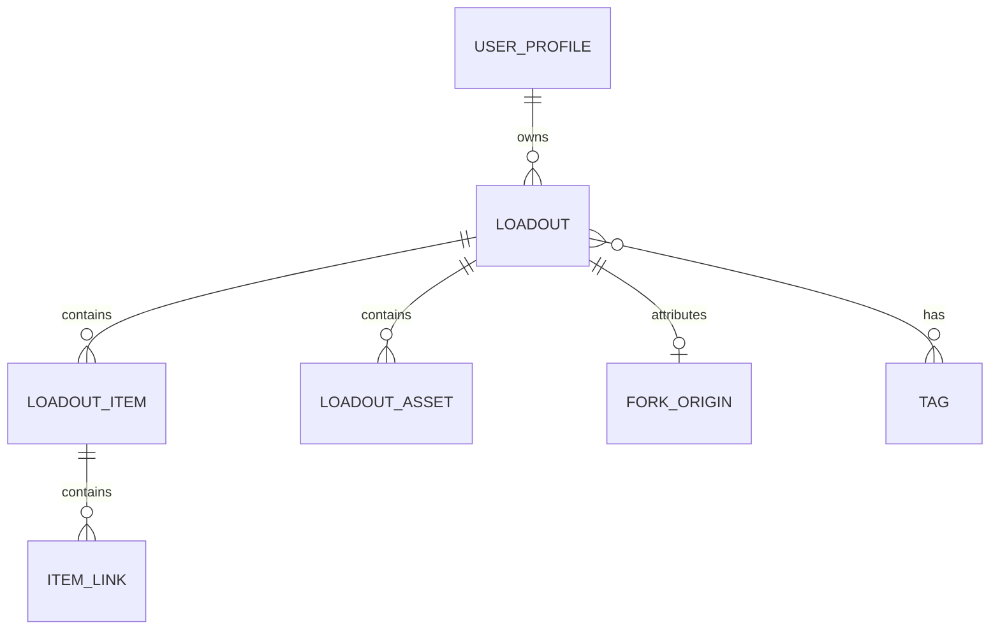

# Persistence V1

## Status

The persistence package is a working local data foundation. The app target
constructs one model container at launch, injects `SwiftDataPersistence` and
`FileMediaStore`, and uses their snapshots in Create Kit, My Kits, and kit
detail. The local profile setup, editor, and published detail flow are wired;
the complete BagLog V1 still requires the user-facing fork journey.

This distinction is intentional in the documentation. The package should stay
small enough to support the V1 loop, while the app layer owns the user journey.

## V1 outcome

A person can locally:

1. create a loadout;
2. add, order, update, and remove items and links;
3. add tags and asset metadata;
4. mark a loadout public and published locally; and
5. fork a local published loadout into a separate private draft.

Forking copies item and link values into fresh records and retains a
`ForkOrigin` snapshot. It does not copy local media files.

## Current package layout

```text
BagLogPackage/Sources/Persistence/
├── Media/
│   └── FileMediaStore.swift
├── Models/
│   ├── Loadout/
│   │   ├── Data/Loadout.swift
│   │   └── Parameters/
│   ├── LoadoutItem/Data/LoadoutItem.swift
│   ├── User/UserProfile.swift
│   └── PersistenceModels.swift
├── Schema/
│   └── PersistenceSchema.swift
├── Store/
│   ├── SwiftDataPersistence.swift
│   ├── SwiftDataPersistence+Profiles.swift
│   ├── SwiftDataPersistence+Loadouts.swift
│   └── SwiftDataPersistence+Support.swift
└── Types/
    └── PersistenceDTOs.swift
```

The remaining types in `PersistenceModels.swift`—`ItemLink`, `LoadoutAsset`,
`Tag`, `ForkOrigin`, and `SavedLoadout`—are valid persisted records. Moving
them into similarly named files is a readability-only change and must not
change their schema or relationships after a store has shipped.

## Data model



| Record | Responsibility | Delete behaviour |
| --- | --- | --- |
| `UserProfile` | Local creator identity | Cascades locally owned loadouts during account reset. |
| `Loadout` | Aggregate root | Cascades items, assets, and fork origin. |
| `LoadoutItem` | A thing in one loadout | Cascades product/reference links. |
| `ItemLink` | HTTPS reference for an item | Deleted with its item. |
| `LoadoutAsset` | File metadata and optional thumbnail | Deleted with its loadout. |
| `Tag` | Reusable local tag | Nullified from a deleted loadout. |
| `ForkOrigin` | Immutable source attribution | Deleted with its fork. |
| `SavedLoadout` | Future local saved-reference record | No V1 store API yet. |

All persisted records use application-owned `UUID`s. `PersistentIdentifier` is
never exposed outside SwiftData.

## Store API

`SwiftDataPersistence` is an actor. It creates a private `ModelContext` from a
shared `ModelContainer`, performs fetches and mutations there, calls `save()`,
then returns snapshots.

```swift
protocol BagLogPersisting: Sendable {
    func localProfile() async throws -> UserProfileSnapshot?
    func profile(id: UUID) async throws -> UserProfileSnapshot?
    func saveProfile(_ command: SaveUserProfileCommand) async throws -> UserProfileSnapshot
    func loadout(id: UUID) async throws -> LoadoutSnapshot?
    func loadouts() async throws -> [LoadoutSnapshot]
    func loadouts(ownerID: UUID) async throws -> [LoadoutSnapshot]
    func saveLoadout(_ command: SaveLoadoutCommand) async throws -> LoadoutSnapshot
    func forkLoadout(_ command: ForkLoadoutCommand) async throws -> LoadoutSnapshot
    func deleteLoadout(id: UUID) async throws
}
```

Despite their current names, `*Command` values are plain input DTOs, not a
command bus or a separate domain architecture. They describe data to save and
keep SwiftData records from crossing actor boundaries. If the editor is kept
local-only, they may be renamed to `*Draft` in one deliberate API cleanup.

`*Snapshot` values are immutable read DTOs for a caller. A caller must not
retain or mutate an `@Model` instance it received from the persistence layer.

## Media

`FileMediaStore` owns files below `Application Support/BagLog/Media`. It names
files from an asset UUID; its image-import path accepts image types with simple
alphanumeric extensions and generates a downsampled JPEG thumbnail.
SwiftData stores the ordered `localFileName`, remote URL metadata, and thumbnail
bytes so views never decode full-resolution source photos.

The current store does **not** coordinate database deletion with file deletion.
For V1, the editor should call `FileMediaStore.remove(fileNamed:)` after it has
successfully deleted asset metadata. A later maintenance task can reconcile
orphaned files. Do not claim automatic media cleanup until that coordination is
implemented and tested.

## Deferred from V1

The following fields and records are present for a future transition, but do
not represent finished features:

| Deferred concern | Existing foundation | Still required |
| --- | --- | --- |
| Remote sync | `remoteID`, `remoteRevision`, `syncState` | API client, conflict policy, acknowledgement flow, retry queue. |
| Saved loadouts | `SavedLoadout` model | Save/unsave/query API and UI. |
| Remote media | `remoteURLString` | Upload/download client and lifecycle handling. |
| Public catalogue | `visibility` and `status` | Authentication, publication service, discovery, moderation. |
| Account reset | Cascade relationship | Explicit destructive user flow and file cleanup. |

These should not drive V1 UI or validation until the associated feature is
implemented end to end.

## Verification

The package currently has Swift Testing coverage for:

- local-profile lookup;
- saving and explicitly updating an ordered loadout graph, item categories,
  links, galleries, and normalised tags;
- rejecting non-HTTPS links;
- forking without sharing item/link identifiers or private media; and
- importing, downsampling, finding, and removing managed media.

Run from `BagLogPackage/`:

```sh
swift test
swift build --sdk "$(xcrun --sdk iphonesimulator --show-sdk-path)" \
  --triple arm64-apple-ios18.0-simulator
```

## Next implementation step

Before adding sync, subscriptions, or discovery, finish the local fork journey
on top of the existing editor and add the remaining create → publish → fork UI
coverage. Everything else can wait until that loop is usable.
