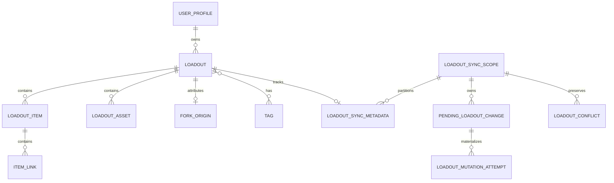

# Persistence

## Status

The persistence package is the local source of truth for BagLog. The app target
constructs one versioned model container at launch and injects
`SwiftDataPersistence` and `FileMediaStore`. Create Kit, My Kits, kit detail,
and the optional private sync engine communicate through immutable values.

Schema V2 adds durable, account-scoped private-loadout synchronization while
preserving the local-first Release 1.0 behavior. Schema V3 enforces the
one-attempt-per-pending-change queue invariant and indexes that lookup.
`Persistence` remains independent of SwiftUI, URLSession, transport DTOs, and
authentication.

## Local outcome

A person can locally:

1. create a loadout;
2. add, order, update, and remove items and links;
3. add tags and asset metadata;
4. mark a loadout public and published locally; and
5. fork a local published loadout into a separate private draft.

Forking copies item and link values into fresh records and retains a
`ForkOrigin` snapshot. It does not copy local media files.

With the DEBUG-only sync flag enabled and a remote account scope active, saving
an eligible private draft also records a logical pending change in the same
explicit SwiftData save. Local editing never waits for a network response.

## Current package layout

```text
BagLogPackage/Sources/Persistence/
├── Media/
│   └── FileMediaStore.swift
├── Models/
│   ├── Loadout/
│   │   ├── Data/Loadout.swift
│   │   └── Parameters/
│   ├── LoadoutItem/Data/LoadoutItem.swift
│   ├── User/UserProfile.swift
│   └── PersistenceModels.swift
├── Schema/
│   └── PersistenceSchema.swift
├── Store/
│   ├── SwiftDataPersistence.swift
│   ├── SwiftDataPersistence+Profiles.swift
│   ├── SwiftDataPersistence+Loadouts.swift
│   ├── SwiftDataPersistence+Sync.swift
│   └── SwiftDataPersistence+Support.swift
├── Sync/
│   ├── LoadoutSyncScope.swift
│   ├── LoadoutSyncMetadata.swift
│   ├── PendingLoadoutChange.swift
│   ├── LoadoutMutationAttempt.swift
│   ├── LoadoutConflict.swift
│   └── LoadoutSyncValues.swift
└── Types/
    └── PersistenceDTOs.swift
```

The remaining types in `PersistenceModels.swift`—`ItemLink`, `LoadoutAsset`,
`Tag`, `ForkOrigin`, and `SavedLoadout`—are valid persisted records. Moving
them into similarly named files is a readability-only change and must not
change their schema or relationships after a store has shipped.

## Data model


```mermaid
erDiagram
    USER_PROFILE ||--o{ LOADOUT : owns
    LOADOUT ||--o{ LOADOUT_ITEM : contains
    LOADOUT_ITEM ||--o{ ITEM_LINK : contains
    LOADOUT ||--o{ LOADOUT_ASSET : contains
    LOADOUT ||--o| FORK_ORIGIN : attributes
    LOADOUT }o--o{ TAG : has
    LOADOUT ||--o| LOADOUT_SYNC_METADATA : tracks
    LOADOUT_SYNC_SCOPE ||--o{ LOADOUT_SYNC_METADATA : partitions
    LOADOUT_SYNC_SCOPE ||--o{ PENDING_LOADOUT_CHANGE : owns
    PENDING_LOADOUT_CHANGE ||--o{ LOADOUT_MUTATION_ATTEMPT : materializes
    LOADOUT_SYNC_SCOPE ||--o{ LOADOUT_CONFLICT : preserves
```

| Record | Responsibility | Delete behaviour |
| --- | --- | --- |
| `UserProfile` | Local creator identity | Cascades locally owned loadouts during account reset. |
| `Loadout` | Aggregate root | Cascades items, assets, and fork origin. |
| `LoadoutItem` | A thing in one loadout | Cascades product/reference links. |
| `ItemLink` | HTTPS reference for an item | Deleted with its item. |
| `LoadoutAsset` | File metadata and optional thumbnail | Deleted with its loadout. |
| `Tag` | Reusable local tag | Nullified from a deleted loadout. |
| `ForkOrigin` | Immutable source attribution | Deleted with its fork. |
| `SavedLoadout` | Future local saved-reference record | No V1 store API yet. |
| `LoadoutSyncScope` | Remote/local profile binding and pull cursors | Retained across sign-out. |
| `LoadoutSyncMetadata` | Per-loadout scope, generation, acknowledged revision, and detach state | Preserved with the local aggregate. |
| `PendingLoadoutChange` | Coalescible logical local intention | Removed only after acknowledgement or explicit resolution. |
| `LoadoutMutationAttempt` | Immutable wire attempt and retry state | Retains body, idempotency key, operation, and expected revision. |
| `LoadoutConflict` | Durable local/remote or local/tombstone pair | Removed only by an explicit conflict resolution. |

All persisted records use application-owned `UUID`s. `PersistentIdentifier` is
never exposed outside SwiftData.

## Store API

`SwiftDataPersistence` is an actor. It creates a private `ModelContext` from a
shared `ModelContainer`, performs fetches and mutations there, calls `save()`,
then returns snapshots.

```swift
protocol BagLogPersisting: Sendable {
    func localProfile() async throws -> UserProfileSnapshot?
    func profile(id: UUID) async throws -> UserProfileSnapshot?
    func saveProfile(_ command: SaveUserProfileCommand) async throws -> UserProfileSnapshot
    func loadout(id: UUID) async throws -> LoadoutSnapshot?
    func loadouts() async throws -> [LoadoutSnapshot]
    func loadouts(ownerID: UUID) async throws -> [LoadoutSnapshot]
    func saveLoadout(_ command: SaveLoadoutCommand) async throws -> LoadoutSnapshot
    func forkLoadout(_ command: ForkLoadoutCommand) async throws -> LoadoutSnapshot
    func deleteLoadout(id: UUID) async throws
}
```

Despite their current names, `*Command` values are plain input DTOs, not a
command bus or a separate domain architecture. They describe data to save and
keep SwiftData records from crossing actor boundaries. If the editor is kept
local-only, they may be renamed to `*Draft` in one deliberate API cleanup.

`*Snapshot` values are immutable read DTOs for a caller. A caller must not
retain or mutate an `@Model` instance it received from the persistence layer.

`BagLogSyncPersisting` extends this boundary with small operations for scope
activation, pending-work selection, immutable attempt materialization,
attempt-start persistence, acknowledgement/retry/failure handling, atomic pull
page application, pull reset, and conflict resolution. The store never
performs a network request.

## Schema migrations

`BagLogSchemaV1` is unchanged. `BagLogSchemaV2` adds the five sync records and a
custom V1 → V2 migration stage.

`BagLogSchemaV3` keeps the V2 data shape and adds a uniqueness constraint and
index for `LoadoutMutationAttempt.pendingChangeID`. V1 and V2 each own frozen
model definitions so future model edits cannot silently rewrite a historical
schema. V2 → V3 uses a lightweight migration.

The old `Loadout.remoteRevision` placeholder remains in the V1 model for store
compatibility. During migration, a positive decimal value becomes the typed
`Int64` `LoadoutSyncMetadata.acknowledgedRevision`; invalid or non-positive
legacy values are discarded, and the string field is cleared. The migration
does not delete or rebuild an incompatible store.

Migration tests create populated V1 and V2 file stores and reopen them through
the current schema, verifying preservation of profiles, aggregate
relationships, tags, assets, fork attribution, converted revisions, and
durable sync queue state.

## Private draft synchronization

Only `private` + `draft` aggregates are eligible. The synchronized projection
contains the stable loadout UUID, title, summary, category, ordered items,
ordered HTTPS links, and normalized tags. Local ownership, status, visibility,
assets, thumbnails, fork attribution, and local timestamps are not sent.

Durability rules:

- the aggregate and logical pending change save together;
- pending work may coalesce only while no immutable attempt represents it;
- an attempt is persisted before the first request and marked started before
  network I/O;
- cancellation, timeout, restart, and unknown create results replay the exact
  operation, encoded bytes, idempotency key, and `If-Match` revision;
- a newer edit creates a later generation without mutating an existing
  attempt;
- an acknowledgement updates the typed revision and removes only the work it
  proves complete;
- a bootstrap or incremental page and its cursor progress save atomically; and
- account scope IDs partition metadata, pending work, attempts, and conflicts.

Publishing or archiving an acknowledged private draft keeps the full local
aggregate but queues a revisioned eligibility-detach delete. Its returning
remote tombstone does not remove the published or archived copy. A draft whose
create result is unknown is replayed before that delete. Re-entering the synced
private-draft state with the same server UUID is rejected for this milestone.

An acknowledged remote tombstone removes an unchanged eligible local draft. If
there is unsent work, it becomes a durable tombstone conflict instead. Choosing
to duplicate local creates a private draft with fresh loadout, item, and link
UUIDs so it cannot collide with the server's retained soft-deleted identity.
A tombstone matching a pending local delete completes that intention
idempotently. A revision-stale delete against a newer server aggregate restores
its recovery snapshot as a visible conflict, where the person can rebase the
delete or keep the server version.

Remote upserts replace only the synchronized projection. Local media,
thumbnails, fork metadata, ownership, and other richer local fields survive.

## Media

`FileMediaStore` owns files below `Application Support/BagLog/Media`. It names
files from an asset UUID; its image-import path accepts image types with simple
alphanumeric extensions and generates a downsampled JPEG thumbnail.
SwiftData stores the ordered `localFileName`, remote URL metadata, and thumbnail
bytes so views never decode full-resolution source photos.

The current store does **not** coordinate database deletion with file deletion.
For V1, the editor should call `FileMediaStore.remove(fileNamed:)` after it has
successfully deleted asset metadata. A later maintenance task can reconcile
orphaned files. Do not claim automatic media cleanup until that coordination is
implemented and tested.

## Deferred

The following fields and records are present for a future transition, but do
not represent finished features:

| Deferred concern | Existing foundation | Still required |
| --- | --- | --- |
| Public, archived, or published sync | Private-draft projection and detach behavior | Later backend aggregate support and product policy. |
| Saved loadouts | `SavedLoadout` model | Save/unsave/query API and UI. |
| Remote media | Local assets and `remoteURLString` placeholder | Upload/download client and lifecycle handling. |
| Public catalogue | `visibility` and `status` | Authentication, publication service, discovery, moderation. |
| Account reset | Cascade relationship | Explicit destructive user flow and file cleanup. |

These should not drive V1 UI or validation until the associated feature is
implemented end to end.

## Verification

The package has Swift Testing coverage for:

- local-profile lookup;
- saving and explicitly updating an ordered loadout graph, item categories,
  links, galleries, and normalised tags;
- rejecting non-HTTPS links;
- forking without sharing item/link identifiers or private media; and
- importing, downsampling, finding, and removing managed media;
- V1 → current-schema migration from a populated file store;
- V2 → V3 migration with durable sync queue state;
- atomic local save/enqueue and atomic pull-page rollback;
- immutable attempts, newer local generations, and exact-retry state;
- acknowledged and conflicting tombstones;
- conflict resolution, including fresh identifiers for duplicated local work;
  and
- account-scope isolation.

Run from `BagLogPackage/`:

```sh
swift test
swift build --sdk "$(xcrun --sdk iphonesimulator --show-sdk-path)" \
  --triple arm64-apple-ios18.0-simulator
```

The app-level simulator suite additionally covers API serialization and
headers, strict response validation, one forced refresh after `401`, refresh
deduplication, engine restart/retry, stale revision preservation, cursor-expiry
bootstrap recovery, and account switching.
